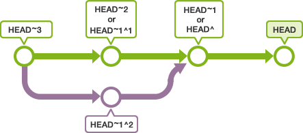
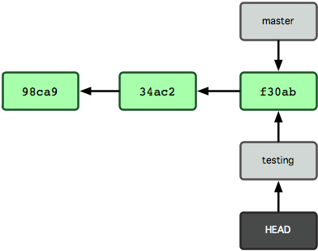
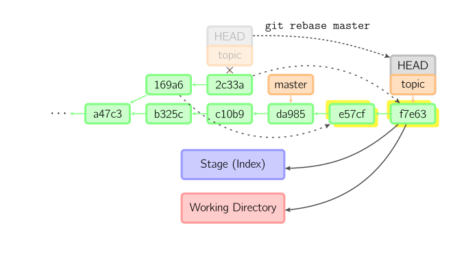

git 分支
==============


## Git branch 分支管理

### 分支简介
分支是为了将修改记录的整体流程分叉保存。分叉后的分支不受其他分支的影响，所以在同一个数据库里可以同时进行多个修改
`git`中的分支其实就是一个可移动指针,指向提交对象

### 分支创建
```shell
#创建分支
git branch testing
```
上面的命令创建了`testing`分支,但是当前分支还是`master`


`git`有一个名为`HEAD`的特殊指针指向当前的分支

提交时使用~(tilde)和^(caret)就可以指定某个提交的相对位置。最常用的就是相对于HEAD的位置。HEAD后面加上~(tilde）可以指定HEAD之前的提交记录。合并分支会有多个根节点，您可以用^(caret) 来指定使用哪个为根节点



`git log --oneline --decorate`用于查看各个分支当前所指的对象
```shell
12b9f27 (HEAD -> testing) work d.txt
716cae2 (tag: v1.0, origin/master, origin/HEAD, master) branch 8
7c64b0b stash work 1
```


### 分支切换
在切换分支时，一定要注意你工作目录里的文件会被改变。 如果是切换到一个较旧的分支，你的工作目录会恢复到该分支最后一次提交时的样子。
```shell
#切换到testing分支
git checkout testing
```


```shell
#以当前分支状态创建分支并且切换到新分支相当于git branch iss53,git checkout iss53
git checkout  -b iss53
```

### Git merge分支合并
merge 命令把不同分支合并起来。合并前，索引必须和当前提交相同。如果另一个分支是当前提交的祖父节点，那么合并命令将什么也不做。 另一种情况是如果当前提交是另一个分支的祖父节点，就导致fast-forward合并。指向只是简单的移动，并生成一个新的提交。


否则就是一次真正的合并。默认把当前提交(ed489 如下所示)和另一个提交(33104)以及他们的共同祖父节点(b325c)进行一次三方合并。结果是先保存当前目录和索引，然后和父节点33104一起做一次新提交。


```shell
#将分支的所有提交合并成一次提交并入当前分支
git merge --squash
```

### 删除分支
```shell
git branch -d <branchname>
```

## Git rebase
`衍合`是合并命令的另一种选择。合并把两个父分支合并进行一次提交，提交历史不是线性的。`衍合`在当前分支上重演另一个分支的历史，提交历史是线性的。 本质上，这是线性化的自动的 cherry-pick


上面的命令都在topic分支中进行，而不是master分支，在master分支上重演，并且把分支指向新的节点。注意旧提交没有被引用，将被回收。

要限制回滚范围，使用`--onto`选项。下面的命令在master分支上重演当前分支从169a6以来的最近几个提交，即2c33a。


同样有`git rebase --interactive`让你更方便的完成一些复杂操作，比如丢弃、重排、修改、合并提交。没有图片体现这些

### 完整工作流
```shell
#git支持很多种工作流程，我们采用的一般是这样，远程创建一个主分支，本地每人创建功能分支，日常工作流程如下：
#去自己的工作分支
git checkout work
#工作
....
#提交工作分支的修改
git commit -a
#回到主分支
git checkout master
#获取远程最新的修改，此时不会产生冲突
git pull
#回到工作分支
git checkout work
#用rebase合并主干的修改，如果有冲突在此时解决
git rebase master
#解决冲突后
git add .
# --continue:完成rebase  --abort 中断rebase过程 --skip忽略冲突
git rebase --continue
#回到主分支
git checkout master
#合并工作分支的修改，把分支提交合并成一个
git merge --squash work
#提交到远程主干
git push
#这样做的好处是，远程主干上的历史永远是线性的。每个人在本地分支解决冲突，不会在主干上产生冲突
```


###  合并提交
```shell
#要合并的前面全部改成s
git rebase -i  51c5b4850060ff675f4541b8b7cd479f94b743e8
```

## Git cherry
cherry-pick命令"复制"一个提交节点并在当前分支做一次完全一样的新提交。


## 删除远程分支
```shell
#删除本地分支
git branch -D test
#删除远程分支
git push origin :test
```