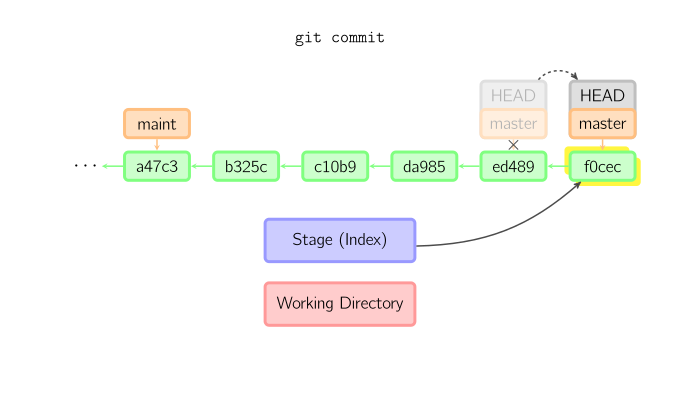
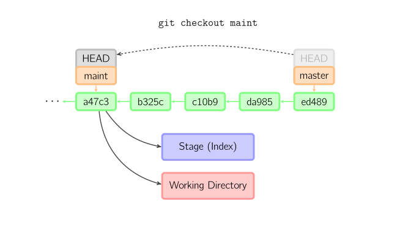
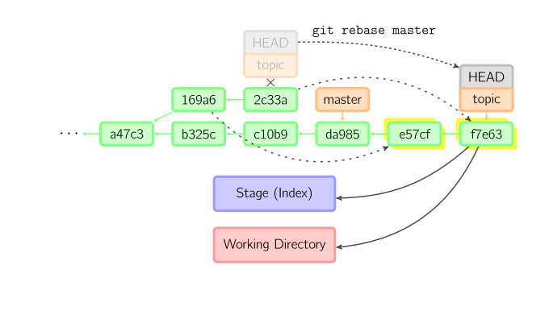

git 操作
==============
## 仓库、缓冲区、工作副本


## Git配置
Git 自带一个 `git config` 的工具来帮助设置控制 Git 外观和行为的配置变量。 这些变量存储在三个不同的位置：

1.  `--system` 修改 `/etc/gitconfig` 文件: 所有用户共用

2.   `--global` 修改 `~/.gitconfig` 或 `~/.config/git/config` 文件：只针对当前用户

3.  当前仓库的 Git 目录中的 `config` 文件（就是 `.git/config`）：针对该仓库。

优先级:当前仓库`config` > 当前用户 >所有用户


### 配置

```shell
#作者
git config --global user.name "John Doe"
git config --global user.email johndoe@example.com
#文本信息
git config --global core.editor emacs
```

### 检查配置信息
```shell
#查看所有
git config --list
#查看某项
git config user.name
```


## Git init
初始化仓库，该命令将创建一个名为 .git 的子目录，这个子目录含有你初始化的 Git 仓库中所有的必须文件，这些文件是 Git 仓库的骨干

## Git status
```shell
#显示状态
git status
#短格式显示
git status -s
```

状态标识:
+ ' ' = unmodified
+ M = modified
+ A = added
+ D = deleted
+ R = renamed
+ C = copied
+ U = updated but unmerged

```shell
X          Y     Meaning
-------------------------------------------------
          [MD]   not updated
M        [ MD]   updated in index
A        [ MD]   added to index
D         [ M]   deleted from index
R        [ MD]   renamed in index
C        [ MD]   copied in index
[MARC]           index and work tree matches
[ MARC]     M    work tree changed since index
[ MARC]     D    deleted in work tree
-------------------------------------------------
D           D    unmerged, both deleted
A           U    unmerged, added by us
U           D    unmerged, deleted by them
U           A    unmerged, added by them
D           U    unmerged, deleted by us
A           A    unmerged, both added
U           U    unmerged, both modified
-------------------------------------------------
?           ?    untracked
!           !    ignored
```

## Git remove
用于移除仓库中的文件,如`git rm *.txt`移除所的的txt文件


## Git commit
提交时，git用暂存区域的文件创建一个新的提交，并把此时的节点设为父节点。然后把当前分支指向新的提交节点。下图中，当前分支是master。 在运行命令之前，master指向ed489，提交后，master指向新的节点f0cec并以ed489作为父节点


即便当前分支是某次提交的祖父节点，git会同样操作。下图中，在master分支的祖父节点maint分支进行一次提交，生成了1800b。 这样，maint分支就不再是master分支的祖父节点。此时，合并 (或者 衍合) 是必须的。


如果想更改一次提交，使用 git commit --amend。git会使用与当前提交相同的父节点进行一次新提交，旧的提交会被取消。


#### HEAD标识处于分离状态时的提交操作
当HEAD处于分离状态（不依附于任一分支）时，提交操作可以正常进行，但是不会更新任何已命名的分支。(你可以认为这是在更新一个匿名分支。)


一旦此后你切换到别的分支，比如说master，那么这个提交节点（可能）再也不会被引用到，然后就会被丢弃掉了。注意这个命令之后就不会有东西引用2eecb。


但是，如果你想保存这个状态，可以用命令git checkout -b name来创建一个新的分支。


## Git checkout
checkout命令用于从历史提交（或者暂存区域）中拷贝文件到工作目录，也可用于切换分支。

+ `git checkout HEAD a.txt`:从`提交快照`中提取文件到`暂存区`和`工作空间`中
+ `git checkout  a.txt`:从`暂存区`中提取文件到`工作空间`中
+ `git checkout  master`:切换分支

当给定某个文件名（或者打开-p选项，或者文件名和-p选项同时打开）时，git会从指定的提交中拷贝文件到暂存区域和工作目录。比如，git checkout HEAD~ foo.c会将提交节点HEAD~(即当前提交节点的父节点)中的foo.c复制到工作目录并且加到暂存区域中。（如果命令中没有指定提交节点，则会从暂存区域中拷贝内容。）注意当前分支不会发生变化


当不指定文件名，而是给出一个（本地）分支时，那么HEAD标识会移动到那个分支（也就是说，我们“切换”到那个分支了），然后暂存区域和工作目录中的内容会和HEAD对应的提交节点一致。新提交节点（下图中的a47c3）中的所有文件都会被复制（到暂存区域和工作目录中）；只存在于老的提交节点（ed489）中的文件会被删除；不属于上述两者的文件会被忽略，不受影响。



如果既没有指定文件名，也没有指定分支名，而是一个标签、远程分支、SHA-1值或者是像master~3类似的东西，就得到一个匿名分支，称作detached HEAD（被分离的HEAD标识）。这样可以很方便地在历史版本之间互相切换。比如说你想要编译1.6.6.1版本的git，你可以运行git checkout v1.6.6.1（这是一个标签，而非分支名），编译，安装，然后切换回另一个分支，比如说git checkout master。然而，当提交操作涉及到“分离的HEAD”时，其行为会略有不同，详情见在下面。


## Git reset
reset命令把当前分支指向另一个位置，并且有选择的变动工作目录和索引。也用来在从历史仓库中复制文件到索引，而不动工作目录。


如果不给选项，那么当前分支指向到那个提交。如果用--hard选项，那么工作目录也更新，如果用--soft选项，那么都不变


如果没有给出提交点的版本号，那么默认用HEAD。这样，分支指向不变，但是索引会回滚到最后一次提交，如果用--hard选项，工作目录也同样。


如果给了文件名(或者 -p选项), 那么工作效果和带文件名的checkout差不多，除了索引被更新。


### Git reset 还原
`git reset HEAD~`

`git reset 'HEAD@{1}'`或者 `git reset ORIG_HEAD`

## Git revert


## 总结

+ git add files 把当前文件放入暂存区域。
+ git commit 给暂存区域生成快照并提交。
+ git reset -- files 用来撤销最后一次git add files，你也可以用git reset 撤销所有暂存区域文件。
+ git checkout -- files 把文件从暂存区域复制到工作目录，用来丢弃本地修改。


## Git clone
如果你想获得一份已经存在了的 Git 仓库的拷贝，比如说，你想为某个开源项目贡献自己的一份力，这时就要用到 git clone 命令。 如果你对其它的 VCS 系统（比如说Subversion）很熟悉，请留心一下你所使用的命令是"clone"而不是"checkout"

```shell
git clone https://github.com/libgit2/libgit2
```

## Git remote
远程仓库管理
```shell
#查看远程仓库别名
git remote
#查看远程仓库地址
git remote -v
#添加远程仓库
git remote add up https://git.coding.net/farwmarth/test_git.git
#查看远程仓库详细的分析信息
git remote show origin
#把 pb 改成 paul
git remote rename  pb paul
#移除远程仓库链接
git remote rm up
```

git branch

##  Git megre
merge 命令把不同分支合并起来。合并前，索引必须和当前提交相同。如果另一个分支是当前提交的祖父节点，那么合并命令将什么也不做。 另一种情况是如果当前提交是另一个分支的祖父节点，就导致fast-forward合并。指向只是简单的移动，并生成一个新的提交。


否则就是一次真正的合并。默认把当前提交(ed489 如下所示)和另一个提交(33104)以及他们的共同祖父节点(b325c)进行一次三方合并。结果是先保存当前目录和索引，然后和父节点33104一起做一次新提交。


git tag

## Git查看日志
```shell
#查看最后一条提交
git log -1
#查看以往提交历史（包括 撤销回退 记录）
git reflog
```

git pull
git push
git fetch

gitk

## Git查看提交变动
+ `git diff` :比较`工作区`和`暂存区`的变化
+ `git diff --cached` 与 `git diff --staged`  相同 :比较`暂存区`与`提交快照`的变化
+ `git diff HEAD` :比较`工作区`与`提交快照`的变化


git mv
git show
## Git Stash

### git stash clear 后恢复
```shell
git fsck --lost-found
git show 8dd73fa8d14880182f11e24dc10bca570b6127d7
git merge 8dd73fa8d14880182f11e24dc10bca570b6127d7
```

git stash

## Git rebase
衍合是合并命令的另一种选择。合并把两个父分支合并进行一次提交，提交历史不是线性的。衍合在当前分支上重演另一个分支的历史，提交历史是线性的。 本质上，这是线性化的自动的 cherry-pick


上面的命令都在topic分支中进行，而不是master分支，在master分支上重演，并且把分支指向新的节点。注意旧提交没有被引用，将被回收。

要限制回滚范围，使用--onto选项。下面的命令在master分支上重演当前分支从169a6以来的最近几个提交，即2c33a。


同样有git rebase --interactive让你更方便的完成一些复杂操作，比如丢弃、重排、修改、合并提交。没有图片体现这些


## Git cherry
cherry-pick命令"复制"一个提交节点并在当前分支做一次完全一样的新提交。


git submodule

