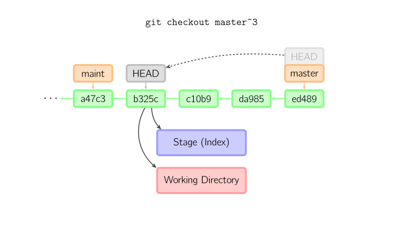
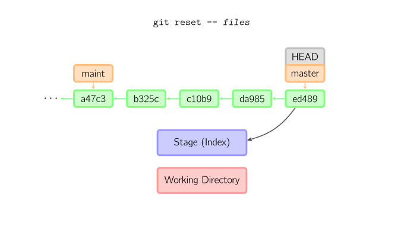

git 操作
==============
## 仓库、缓冲区、工作副本


## Git配置
Git 自带一个 `git config` 的工具来帮助设置控制 Git 外观和行为的配置变量。 这些变量存储在三个不同的位置：

1.  `--system` 修改 `/etc/gitconfig` 文件: 所有用户共用

2.   `--global` 修改 `~/.gitconfig` 或 `~/.config/git/config` 文件：只针对当前用户

3.  当前仓库的 Git 目录中的 `config` 文件（就是 `.git/config`）：针对该仓库。

优先级:当前仓库`config` > 当前用户 >所有用户


### 配置

```shell
#作者
git config --global user.name "John Doe"
git config --global user.email johndoe@example.com
#文本信息
git config --global core.editor emacs
```

### 检查配置信息
```shell
#查看所有
git config --list
#查看某项
git config user.name
#移除设置
git config --unset user.name
```


## Git init
初始化仓库，该命令将创建一个名为 .git 的子目录，这个子目录含有你初始化的 Git 仓库中所有的必须文件，这些文件是 Git 仓库的骨干

## Git status
```shell
#显示状态
git status
#短格式显示
git status -s
```

状态标识:

+ ' ' = unmodified
+ M = modified(已修改)
+ A = added(已添加)
+ D = deleted(已删除)
+ R = renamed(已重命名)
+ C = copied(已复制)
+ U = updated but unmerged(已更新但未合并)

```shell
X          Y     Meaning
-------------------------------------------------
          [MD]   not updated
M        [ MD]   updated in index
A        [ MD]   added to index
D         [ M]   deleted from index
R        [ MD]   renamed in index
C        [ MD]   copied in index
[MARC]           index and work tree matches
[ MARC]     M    work tree changed since index
[ MARC]     D    deleted in work tree
-------------------------------------------------
D           D    unmerged, both deleted
A           U    unmerged, added by us
U           D    unmerged, deleted by them
U           A    unmerged, added by them
D           U    unmerged, deleted by us
A           A    unmerged, both added
U           U    unmerged, both modified
-------------------------------------------------
?           ?    untracked
!           !    ignored
```

## Git rm
用于移除仓库中的文件,如`git rm *.txt`移除所的的txt文件

## Git mv
`git`系统中移动一个文件或者目录相当于`shell`命令
```shell
mv oldname newname
git add newname
git rm oldname
```

## Git show
显示对象的更多信息

+ 对于commit,展示log和差异
+ 对于tag,显示tag相关信息
+ 对于tree对象,列出树结构名字
+ 对于blob对象,显示文件内容

```shell
#显示提交信息
git show 716cae27bc24b0f56b0dff5039e6a2cf8ac3edac
#显示分支的信息
git show v1.0.0
```

## Git add
把当前文件放入暂存区域

## Git commit
提交时，git用暂存区域的文件创建一个新的提交，并把此时的节点设为父节点。然后把当前分支指向新的提交节点。下图中，当前分支是master。 在运行命令之前，master指向ed489，提交后，master指向新的节点f0cec并以ed489作为父节点


即便当前分支是某次提交的祖父节点，git会同样操作。下图中，在master分支的祖父节点maint分支进行一次提交，生成了1800b。 这样，maint分支就不再是master分支的祖父节点。此时，合并 (或者 衍合) 是必须的。


如果想更改一次提交，使用 git commit --amend。git会使用与当前提交相同的父节点进行一次新提交，旧的提交会被取消。


#### HEAD标识处于分离状态时的提交操作
当HEAD处于分离状态（不依附于任一分支）时，提交操作可以正常进行，但是不会更新任何已命名的分支。(你可以认为这是在更新一个匿名分支。)


一旦此后你切换到别的分支，比如说master，那么这个提交节点（可能）再也不会被引用到，然后就会被丢弃掉了。注意这个命令之后就不会有东西引用2eecb。


但是，如果你想保存这个状态，可以用命令git checkout -b name来创建一个新的分支。


## Git checkout
checkout命令用于从历史提交（或者暂存区域）中拷贝文件到工作目录，也可用于切换分支。

+ `git checkout HEAD a.txt`:从`提交快照`中提取文件到`暂存区`和`工作空间`中
+ `git checkout  a.txt`:从`暂存区`中提取文件到`工作空间`中
+ `git checkout  master`:切换分支

当给定某个文件名（或者打开-p选项，或者文件名和-p选项同时打开）时，git会从指定的提交中拷贝文件到暂存区域和工作目录。比如，git checkout HEAD~ foo.c会将提交节点HEAD~(即当前提交节点的父节点)中的foo.c复制到工作目录并且加到暂存区域中。（如果命令中没有指定提交节点，则会从暂存区域中拷贝内容。）注意当前分支不会发生变化


当不指定文件名，而是给出一个（本地）分支时，那么HEAD标识会移动到那个分支（也就是说，我们“切换”到那个分支了），然后暂存区域和工作目录中的内容会和HEAD对应的提交节点一致。新提交节点（下图中的a47c3）中的所有文件都会被复制（到暂存区域和工作目录中）；只存在于老的提交节点（ed489）中的文件会被删除；不属于上述两者的文件会被忽略，不受影响。


如果既没有指定文件名，也没有指定分支名，而是一个标签、远程分支、SHA-1值或者是像master~3类似的东西，就得到一个匿名分支，称作detached HEAD（被分离的HEAD标识）。这样可以很方便地在历史版本之间互相切换。比如说你想要编译1.6.6.1版本的git，你可以运行git checkout v1.6.6.1（这是一个标签，而非分支名），编译，安装，然后切换回另一个分支，比如说git checkout master。然而，当提交操作涉及到“分离的HEAD”时，其行为会略有不同，详情见在下面。



### 拉取远程分支并新建本地分支
```shell
git checkout -t origin/2.0.0
#或者
git checkout origin/remoteName -b localName
```

## Git reset
reset命令把当前分支指向另一个位置，并且有选择的变动工作目录和索引。也用来在从历史仓库中复制文件到索引，而不动工作目录。


如果不给选项，那么当前分支指向到那个提交。如果用--hard选项，那么工作目录也更新，如果用--soft选项，那么都不变


如果没有给出提交点的版本号，那么默认用HEAD。这样，分支指向不变，但是索引会回滚到最后一次提交，如果用--hard选项，工作目录也同样。


如果给了文件名(或者 -p选项), 那么工作效果和带文件名的checkout差不多，除了索引被更新。




### Git reset 总结
```shell
#回退到远程版本
git reset --hard origin/master
#从暂存区移除(add之后)
git reset HEAD
#可以回退到某个提交(commit之后)
git reset --hard
#合并时遇到冲突想取消操作，恢复index，用git merge --abort
#git 1.7以来可以撤消合并
git reset --merge
```


### Git reset  反操作
```shell
git reset HEAD~
git reset 'HEAD@{1}'或者 git reset ORIG_HEAD
```


## Git revert
以一个新的提交来覆盖之前的修改
```shell
#恢复到上一个版本HEAD提交并创建一个新的提交覆盖原有的变更
git revert HEAD~
```

### 总结

+ git reset -- files 用来撤销最后一次git add files，你也可以用git reset 撤销所有暂存区域文件。
+ git checkout -- files 把文件从暂存区域复制到工作目录，用来丢弃本地修改。


## Git clone
如果你想获得一份已经存在了的 Git 仓库的拷贝，比如说，你想为某个开源项目贡献自己的一份力，这时就要用到 git clone 命令。 如果你对其它的 VCS 系统（比如说Subversion）很熟悉，请留心一下你所使用的命令是"clone"而不是"checkout"

```shell
git clone https://github.com/libgit2/libgit2
```

## Git fetch
```shell
#只拉取远程仓库信息不合并
git fetch origin
```

## Git pull
把远程仓库更改拉取并且合并到本地当前分支,`git pull`相当于 `git fetch`和`git merge FETCH_HEAD`两步操作
```shell
#拉取并合并
git pull
#拉取远程origin合并到master
git pull origin master
```

## Git push
```shell
#将本地master分支提交推送到远程origin
git push orign master
#设置默认推送
git push --set-upstream origin master
```


## Git remote
远程仓库管理
```shell
#查看远程仓库别名
git remote
#查看远程仓库地址
git remote -v
#添加远程仓库
git remote add up https://git.coding.net/farwmarth/test_git.git
#查看远程仓库详细的分析信息
git remote show origin
#把 pb 改成 paul
git remote rename  pb paul
#移除远程仓库链接
git remote rm up
# 设定remote分支
git remote add -t common(分支名) origin(远程别名) https://git.coding.net/farwmarth/BnHServer.git
```


## Git tag

## Git 查看日志

### git log
默认不用任何参数的话，git log 会按提交时间列出所有的更新，最近的更新排在最上面。 正如你所看到的，这个命令会列出每个提交的 SHA-1 校验和、作者的名字和电子邮件地址、提交时间以及提交说明

```shell
#查看最后一条提交
git log -1
git log -n 1
#显示最开始的提交
git log --reverse
#查看内容差异
git log  -p
#显示所有操作,包括reset
git log  -g

## 仅在提交信息后显示已修改的文件清单。
git log --name-only
## 显示修改文件及状态
git log --name-status


#查看统计信息
git log --stat

commit ca82a6dff817ec66f44342007202690a93763949
Author: Scott Chacon <schacon@gee-mail.com>
Date:   Mon Mar 17 21:52:11 2008 -0700

    changed the version number

 Rakefile | 2 +-
 1 file changed, 1 insertion(+), 1 deletion(-)

#格工化log为一行显示
git log --pretty=oneline
#格工化log 提交对象的简短哈希字串-作者名字,提交时间:提交说明
git log --pretty=format:"%h-%an,%ar:%s"

716cae2-wujiyu,4 weeks ago:branch 8
7c64b0b-wujiyu,4 weeks ago:stash work 1

#显示ASCII 图形表示的分支合并历史
git log --pretty=format:"%h %s" --graph

```

一个实用的log
```
git log --graph --pretty=format:'%Cred%h%Creset -%C(yellow)%d%Creset %s %Cgreen(%cr)%Creset' --abbrev-commit --date=relative
```

查看当前目录下文件的最后提交者
```shell
git ls-tree -r --name-only HEAD | while read filename; do
  echo "$(git log -1 --format="%an %ae" -- $filename) $filename"
done
```

周报
```shell
git log --pretty=format:"%Cred%ad%x09 %Cgreen%s" --date=format:'%Y/%m/%d %a' --since="1 week ago" --until="now" --reverse --author=$(git config user.name)
```

#### 筛选日志
```shell
#时间点以来的提交
git log --since="2016-10-16"
#作者相关提交
git log --author=wujiyu
```

### git reflog
当你 (在一个仓库下) 工作时，Git 会在你每次修改了 HEAD 时悄悄地将改动记录下来。当你提交或修改分支时，reflog 就会更新.
`git reflog`有时候可以帮助你找到丢失掉的commit，比如你在某个detached HEAD（即不在任何分支只是在某个历史的commit的节点上）的时候进行了一次commit，然后你切换到另一个分支想把刚才的东西合并进来，这个时候突然意识到刚才的那次提交找不到了，这时你就可以通过HEAD@{1}引用到刚才的提交了，或者通过git reflog找到对应commit的sha1值，然后进行merge

```shell
#查看以往提交历史（包括 撤销回退 记录）
git reflog
```

### gitk
图形化界面显示log


##  Git fsck
此命令会检查仓库的数据完整性,所有未引用到的悬空对象都会显示出来
```shell
git fsck

dangling blob d670460b4b4aece5915caf5c68d12f560a9fe3e4
dangling commit ab1afef80fac8e34258ff41fc1b867c702daa24b
```


## Git查看提交变动
+ `git diff` :比较`工作区`和`暂存区`的变化
+ `git diff --cached` 与 `git diff --staged`  相同 :比较`暂存区`与`提交快照`的变化
+ `git diff HEAD` :比较`工作区`与`提交快照`的变化


```shell
#比较本地master分支和远程master分支的差异
git diff master origin/master
#比较远程分支与本地文件差异
git diff  origin/master a.txt
```


## Git Stash
保存工作状态

```shell
#保存当前修改的工作空间
git stash
#弹出一个保存的工作空间
git stash pop
#丢弃一个保存的空间
git stash drop stash{1}
#清除全部保存
git stash clear
```


## Git submodule

### Git submodule update
`git submodule update`并不会将submodule切到任何 branch
有些时候你需要对submodule做一些修改，很常见的做法就是切到submodule的目录，然后做修改，然后commit和push。
这里的坑在于，默认git submodule update并不会将submodule切到任何branch，所以，默认下submodule的HEAD是处于游离状态的(‘detached HEAD’ state)。所以在修改前，记得一定要用git checkout master将当前的submodule分支切换到master，然后才能做修改和提交。


### git submodule下还有submodule
```shell
git submodule foreach git submodule update
#递归更新
git submodule update --init --recursive
```


## Git clean
```shell
# 删除 untracked files
git clean -f
# 连 untracked 的目录也一起删掉
git clean -fd
# 连 gitignore 的untrack 文件/目录也一起删掉 （慎用，一般这个是用来删掉编译出来的 .o之类的文件用的）
git clean -xfd
# 在用上述 git clean 前，墙裂建议加上 -n 参数来先看看会删掉哪些文件，防止重要文件被误删
git clean -nxfd
git clean -nf
git clean -nfds
```

## 操作序列附加指令
### --continue
Continue the operation in progress using the information in .git/sequencer. Can be used to continue after resolving conflicts in a failed cherry-pick or revert.

### --quit
Forget about the current operation in progress. Can be used to clear the sequencer state after a failed cherry-pick or revert.

### --abort
Cancel the operation and return to the pre-sequence state.


