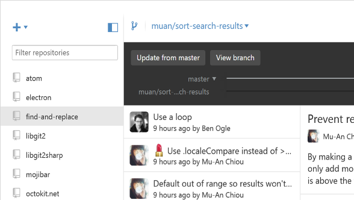
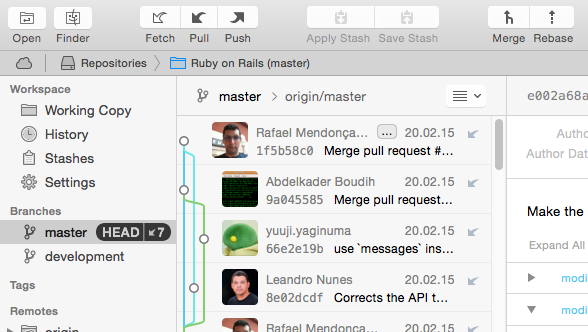
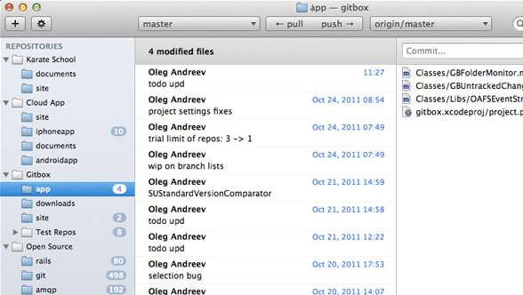
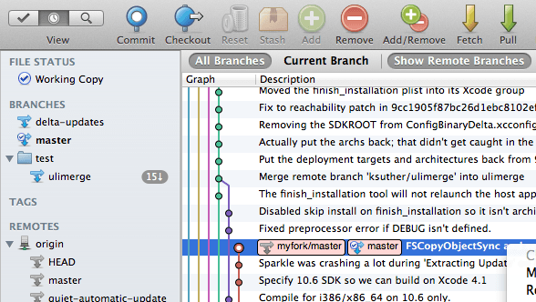
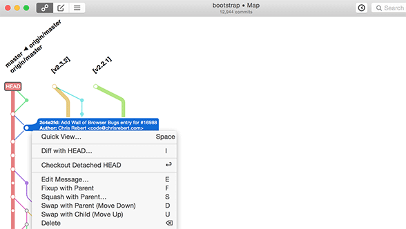
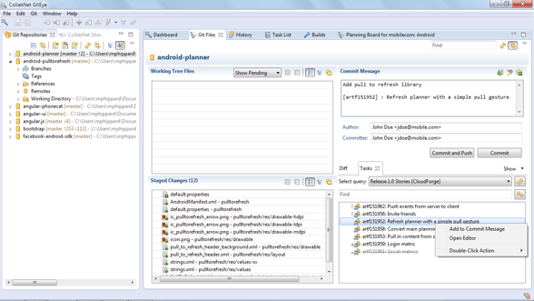
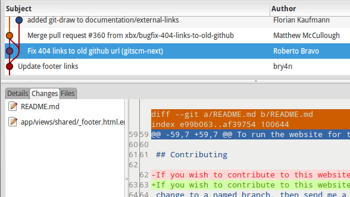

git 工具
=======================

##  工具

### [GitHub Desktop](https://desktop.github.com/)



**Platforms:** Windows, Mac  
**Price:** Free

### [Tower](https://www.git-tower.com/)



**Platforms**: Windows, Mac  
**Price**: $79/user (Free 30 day trial)

### [GitX-dev](https://rowanj.github.io/gitx/)


**Platforms:** Mac  
**Price:** Free

### [Gitbox](http://www.gitboxapp.com/)



**Platforms:** Windows, Mac  
**Price:** $14.99

### [SourceTree](https://www.sourcetreeapp.com/)



**Platforms:** Windows  
**Price:** Free

### [Git Extensions ](https://gitextensions.github.io/)


**Platforms:** Windows, Mac  
**Price:** Free

### [SmartGit](https://desktop.github.com/)


**Platforms:** Windows, Mac, Linux  
**Price:**  $79/user / Free for non-commercial use

### [git-cola](https://git-cola.github.io/)


**Platforms:** Windows, Mac, Linux  
**Price:** Free

### [GitUp](http://gitup.co/)



**Platforms:** Mac  
**Price:** Free

### [GitEye](http://www.giteyeapp.com/)



**Platforms:** Windows, Mac, Linux  
**Price:** Free

### [giggle](https://wiki.gnome.org/Apps/giggle/)


**Platforms:** linux  
**Price:** Free

### [gitg](https://wiki.gnome.org/Apps/Gitg/)



**Platforms:** Linux  
**Price:** Free

### [GitKraken](https://www.gitkraken.com/)


**Platforms:** Windows, Mac, Linux  
**Price:** Free

### [Aurees](https://aurees.com/)


**Platforms:** Windows  
**Price:** $69.99/user / Free for non-commercial use

### [Fork](https://git-fork.com/)


**Platforms:** Mac  
**Price:** Free


## Windows

## Mac

## Linux

### gitk
`gitk` 是一个历史记录的图形化查看器。 你可以把它当作是基于 `git log` 和 `git grep` 命令的一个强大的图形操作界面。 当你需要查找过去发生的某次记录，或是可视化查看项目历史的时候，你将会用到这个工具。

### ubuntu合并对比工具
```shell
#安装meld
sudo apt-get install meld
```

编辑`~/.gitconfig`

```shell
[difftool]
    prompt = false
[mergetool]
    prompt = false
[diff]
    tool = meld
[merge]
    tool = meld

```

使用
```shell
git difftool 文件名
git megretool
```


## 插件

### Eclipse EGit

[http://blog.csdn.net/luckarecs/article/details/7427605](http://blog.csdn.net/luckarecs/article/details/7427605)


[https://git.wiki.kernel.org/index.php/Interfaces,_frontends,_and_tools#Graphical_Interfaces](https://git.wiki.kernel.org/index.php/Interfaces,_frontends,_and_tools#Graphical_Interfaces)